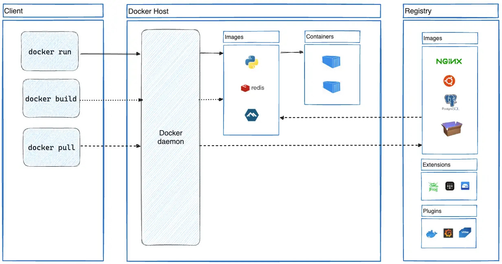

# Introduction Docker ([Documentation officielle](https://docs.docker.com/))

Docker permet d'exécuter des sources/applications dans un environnement isolé (`Environnement docker`) de la machine qui l'exécute que l'on appelle `Conteneur`.

Chaque `conteneur` possède son propre système de fichiers, et toutes les dépendances/logiciels nécessaires pour exécuter le code source y sont installés.  
Ce système de fichiers suit la même arborescence que celui d'un `environnement Linux` sur lequel docker s'appuie pour construire sont écosystème.

**Cela permet d'avoir une base de code qui fonctionne toujours de la même façon quelquesoit la machine physique/OS sur lesquels elle est exécutée.**

**Docker est très bien adapté pour du développement CI/CD**

# Architecture Docker

La commande client **`docker`** (`Docker CLI`) permet d'interagir avec le `démon Docker` qui gère en temps réel tout les objets qui composent l'environnement Docker en cours d'exécution (`conteneurs`, `images`, `volumes`, ...).